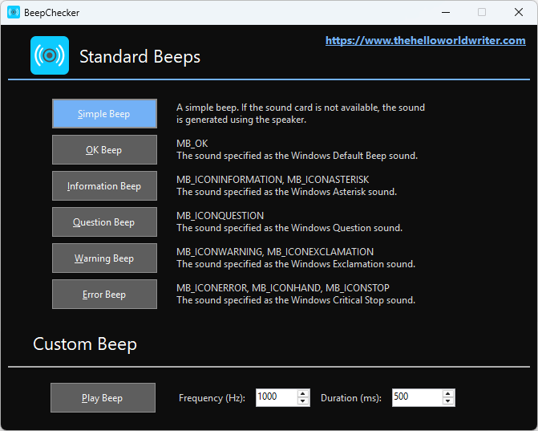
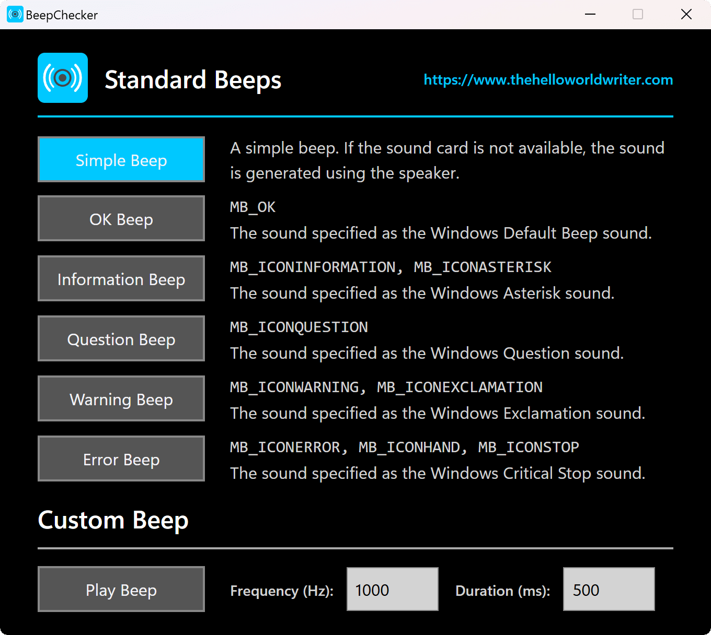

# BeepChecker

BeepChecker is a simple portable Windows program that plays the standard Windows beep sounds: the Information, Question, Warning, or Error sounds. It also lets you play custom beeps by generating simple tones on the speaker.

Use BeepChecker to familiarize yourself with the sound of the different standard Windows beeps, and learn to differentiate between them. Check the system sounds configuration on your PC, or check system sounds across Windows versions and virtual machines. Hardware enthusiast? Test if the beep sounds are generated by the internal PC speaker or by the sound card.

BeepChecker is very easy to use: you can simply download the small executable file and run it directly, without installation. The tidy user interface has a Play button and a description label for each type of beep, and frequency and duration input boxes for generating the custom beep.

## Media Quotes

> "BeepChecker can help you learn the sounds of your OS, so you know what it is trying to tell you the next time it emits a beep. ... An efficient and easy to use application." (**Softpedia Five Star Review**)

> "A handy and effective yet simple tool, especially for those of us who never knew what all the different beeps meant. ... All in all a very neat tool." (**Rocky Bytes Score: Very Good**)

> "BeepChecker can come in handy when you want to familiarize yourself with what the system is trying to tell you, using the sounds. ... All in all, a simple decent freeware." (**I Love Free Software**)

[More Reviews](https://www.thehelloworldwriter.com/beepchecker/reviews/)

## Modern Rewrite

BeepChecker is a **modern Tauri rewrite of a legacy Windows Forms app.** It combines nostalgia with portability and ease of use for the latest Windows versions. The new version faithfully recreates the classic user interface and experience using web technologies. It is built with plain HTML and JavaScript (no frameworks) and styled with Tailwind CSS. The (tiny) backend is written in Rust. BeepChecker does not require .NET Framework or other dependencies (only Microsoft Edge WebView2, which is preinstalled on most Windows systems).

## Screenshots

| Legacy Windows Forms Version | Modern Tauri Version |
|:---------------------------:|:--------------------:|
|  |  |

The new Tauri version preserves the familiar look and feel of the original, while being easier to run and maintain on modern Windows systems.

## Download

### Modern Tauri Version

Runs on **Windows 11 and Windows 10**. Requires [Microsoft Edge WebView2](https://developer.microsoft.com/en-us/Microsoft-edge/webview2/) (preinstalled on most Windows systems). The BeepChecker installers will automatically download and install it if it's not already present.

You can choose between an EXE installer, an MSI installer, or a fully portable edition (ZIP archive containing the standalone EXE, no installation required).

### Legacy Windows Forms Version

Runs on **Windows 11, 10, 8, 7, Vista, and XP** (yes, on all those legacy, out-of-support Windows versions). Requires [.NET Framework 4.8](https://dotnet.microsoft.com/en-us/download/dotnet-framework/net48) (preinstalled on Windows 10 and Windows 11).

You can choose between the EXE installer or a fully portable edition (ZIP archive containing the standalone EXE, no installation required).

## Source Code

The **modern BeepChecker app** is written in [Tauri](https://tauri.app/) and [Rust](https://www.rust-lang.org/) for the backend, and uses plain HTML, JavaScript (no frameworks), and ([Tailwind CSS](https://tailwindcss.com/)) for the frontend. The project is developed using Visual Studio Code and the Tauri CLI. The installation package is built using [NSIS](https://nsis.sourceforge.io/Main_Page) and [WiX Toolset](https://wixtoolset.org/).

The **legacy BeepChecker app** is written in C# using Windows Forms and .NET Framework 4.8. The project is developed using Visual Studio Community 2022, with the help of [StyleCop.Analyzers](https://github.com/DotNetAnalyzers/StyleCopAnalyzers). The installation package is built using [NSIS](https://nsis.sourceforge.io/Main_Page). Most of the source code for the legacy Windows Forms version was originally written back in 2015 **(over a decade ago!)** and it's available in the [`legacy-winforms`](https://github.com/TheHelloWorldWriter/BeepChecker/tree/legacy-winforms) branch.

## Contributions

All contributions are welcome: use-cases, documentation, design, graphics, icons, code, patches, bug reports, feature requests, suggestions, etc. You do not need to be a programmer to speak up! Also, if you like BeepChecker, give it a star here on GitHub! ⭐️

## License

BeepChecker is licensed under the [MIT License](LICENSE).

---

Made with ❤️ in Oradea, Romania  
https://www.thehelloworldwriter.com
